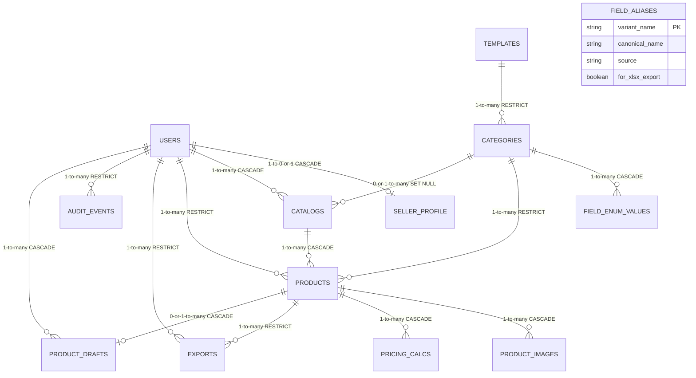

# MeeSell — Database Architecture Reference

**Status:** CANONICAL — operational source of truth for the as-built MeeSell database
**Owner:** Database track (`meesell-database-builder` via the database coordinator)
**Last updated:** 2026-06-05 (Phase 7 authoring)
**Alembic head:** `f31c75438e61`

> **Maintenance rule:** This doc MUST be updated on every schema change (column add/drop/rename,
> new index, new migration, new seed script). A stale entry in this file is a bug.

---

## Section 0 — Purpose, Audience, and Cross-References

This document is the single canonical reference for the MeeSell database **as built and
running in dev** (`postgres-0`, K3s `dev` namespace). It is written for agents and engineers
who need to interact with the schema, write queries, or generate migrations.

**What is IN here:**
- Exact column names, types, constraints, and indexes for all 13 tables (as-built, not as-specced)
- JSONB column shapes with examples
- Complete index inventory
- Migration chain history with gotchas
- Seed pipeline architecture and idempotency contract
- Connection patterns and operational reference
- Invariant queries for schema regression testing

**What is NOT here (follow cross-references instead):**
- Architectural philosophy and founder-locked decisions: `docs/MVP_ARCHITECTURE.md` §12
- Data semantics (why 3,772 categories, why 28 universals): `docs/MEESHO_CATEGORY_INTELLIGENCE.md`
- Audit trail of how the schema evolved: `docs/status/STATUS_DATABASE.md`
- Open gaps and V1.5 deferrals: `docs/MVP_ARCHITECTURE_GAP_DATABASE.md`
- Full gap analysis across all tracks: `docs/MVP_ARCHITECTURE_GAP_ANALYSIS.md`

**Note on §2 of `docs/MVP_ARCHITECTURE.md`:** The DDL in that section is stale relative to
the live schema (4 known deltas). This document supersedes §2 as the authoritative DDL
reference. See Section 2 below for the as-built columns.

---

## Section 1 — High-Level Overview

### Stack

| Component | Version / Detail |
|---|---|
| Database | PostgreSQL 16.14 (Debian 16.14-1.pgdg13+1) |
| Image | Supabase self-hosted Postgres on K3s |
| ORM | SQLAlchemy 2.0 async (typed mapped-column style) |
| Migration tool | Alembic (async env, `transaction_per_migration=True`) |
| Driver | asyncpg (via `postgresql+asyncpg://`) |
| Extensions | `pgcrypto` (UUID generation), `pg_trgm` (trigram search) |

### Deployment

| Setting | Value |
|---|---|
| In-cluster hostname | `postgres.dev.svc.cluster.local:5432` |
| Namespace | `dev` |
| Storage | 20 GB PVC (`prevent_destroy = true`) |
| Local access | `kubectl port-forward -n dev svc/postgres 5433:5432` |
| Credentials | K8s Secret `dev/postgres-credentials` (keys: `database`, `password`, `username`) |

### Current Alembic Migration Chain

```
935e55b4852c (baseline, 13 tables)
    → a1b2c3d4e5f6 (pg_trgm extension + 3 GIN category indexes)
        → f31c75438e61 (idx_product_drafts_saved_at) ← CURRENT HEAD
```

### 13 V1 Tables in 3 Logical Groups

**Group A — Reference Data (seeded; read-mostly)**

| # | Table | Rows (seeded) |
|---|---|---|
| 1 | `field_aliases` | 67 (exact) |
| 2 | `templates` | 3,566 (±0.5% of 3,557 target) |
| 3 | `categories` | 3,772 (exact) |
| 4 | `field_enum_values` | 49,259 (±0.5% of ~49,295 target) |

**Group B — Seller Data (runtime; starts empty)**

| # | Table | Scaling profile |
|---|---|---|
| 5 | `users` | 1 per seller |
| 6 | `seller_profile` | 1 per user (one-to-one) |
| 7 | `catalogs` | ~5-20 per user in V1 |
| 8 | `products` | ~20-100 per user; soft-delete on `deleted_at` |
| 9 | `product_images` | 4 slots per product; 1 compulsory |
| 10 | `pricing_calcs` | ~1-3 calculations per product |
| 11 | `exports` | 1 per export action; append-only record |
| 12 | `product_drafts` | At most 1 row per (user, product); ephemeral |

**Group C — Bookkeeping (runtime; append-only)**

| # | Table | Scaling profile |
|---|---|---|
| 13 | `audit_events` | ~3,000/day at 1,000 sellers (coalesced); BIGSERIAL PK |

---

## Section 2 — Table-by-Table Reference (as-built schema)

### 2.1 — `users`

**Purpose:** Seller identity. One row per registered seller account.
**Group:** Seller Data
**Source files:** `backend/app/models/user.py`, migration `935e55b4852c`
**MVP_ARCHITECTURE reference:** §2.1
**Scaling:** 1 row per seller; no hard V1 cap

**Columns:**

| Column | Type | Constraints | Notes |
|---|---|---|---|
| `id` | `UUID` | PK, `DEFAULT gen_random_uuid()` | Requires pgcrypto |
| `phone` | `VARCHAR(15)` | `NOT NULL`, `UNIQUE`, indexed | E.164 format, e.g. `+919876543210` |
| `email` | `VARCHAR(255)` | nullable | Optional |
| `plan` | `VARCHAR(20)` | `NOT NULL`, `DEFAULT 'free'`, indexed | `free` or `pro` |
| `created_at` | `TIMESTAMPTZ` | `NOT NULL`, `DEFAULT NOW()` | |
| `last_login_at` | `TIMESTAMPTZ` | nullable | Updated on every successful OTP verify |

**Indexes:**

| Name | Columns | Type | Purpose |
|---|---|---|---|
| `users_pkey` | `id` | btree (PK) | Primary lookup |
| `ix_users_phone` | `phone` | btree, UNIQUE | OTP login lookup |
| `ix_users_plan` | `plan` | btree | Plan-gate queries |

**Relationships (from users):**

- `users.id` ← `seller_profile.user_id` ON DELETE CASCADE (1-to-0-or-1)
- `users.id` ← `catalogs.user_id` ON DELETE CASCADE (1-to-many)
- `users.id` ← `products.user_id` ON DELETE RESTRICT (1-to-many; products not auto-deleted)
- `users.id` ← `exports.user_id` ON DELETE RESTRICT (1-to-many; export records survive user deletion)
- `users.id` ← `audit_events.user_id` ON DELETE RESTRICT (audit records survive user deletion)
- `users.id` ← `product_drafts.user_id` ON DELETE CASCADE (drafts deleted with user)

---

### 2.2 — `seller_profile`

**Purpose:** Seller onboarding compliance bucket. Holds the 9 Legal Metrology fields and
conditional super-category extension data.
**Group:** Seller Data
**Source files:** `backend/app/models/seller_profile.py`, migration `935e55b4852c`
**MVP_ARCHITECTURE reference:** §2.2 (NOTE: §2.2 DDL is stale — see Phase notes below)
**Scaling:** Exactly 1 row per user; 1-to-1 join

**Columns:**

| Column | Type | Constraints | Notes |
|---|---|---|---|
| `user_id` | `UUID` | PK + FK → `users.id` ON DELETE CASCADE | Both primary key and foreign key |
| `manufacturer_name` | `TEXT` | `NOT NULL` | Legal Metrology field |
| `manufacturer_address` | `TEXT` | `NOT NULL` | Legal Metrology field |
| `manufacturer_pincode` | `VARCHAR(6)` | `NOT NULL` | 6-digit Indian PIN code |
| `packer_name` | `TEXT` | `NOT NULL` | Legal Metrology field |
| `packer_address` | `TEXT` | `NOT NULL` | Legal Metrology field |
| `packer_pincode` | `VARCHAR(6)` | `NOT NULL` | 6-digit Indian PIN code |
| `importer_name` | `TEXT` | nullable | Optional for domestic sellers |
| `importer_address` | `TEXT` | nullable | |
| `importer_pincode` | `VARCHAR(6)` | nullable | |
| `country_of_origin` | `VARCHAR(64)` | `NOT NULL`, `DEFAULT 'India'` | |
| `compliance_extensions` | `JSONB` | `NOT NULL`, `DEFAULT '{}'` | See §4.1 for shape |
| `active_super_categories` | `TEXT[]` | `NOT NULL`, `DEFAULT '{}'`, GIN indexed | Super-category IDs seller sells in |
| `onboarding_complete` | `BOOLEAN` | `NOT NULL`, `DEFAULT false` | Set true once all compulsory fields filled |
| `created_at` | `TIMESTAMPTZ` | `NOT NULL`, `DEFAULT NOW()` | |
| `updated_at` | `TIMESTAMPTZ` | `NOT NULL`, `DEFAULT NOW()` | Updated by service layer on each PUT |

**Indexes:**

| Name | Columns | Type | Purpose |
|---|---|---|---|
| `seller_profile_pkey` | `user_id` | btree (PK) | Primary lookup |
| `idx_seller_profile_super_cats` | `active_super_categories` | GIN | Array containment: `WHERE active_super_categories @> '{26}'` |
| `fk_seller_profile_user_id` | `user_id` | FK constraint | (enforced by PK; no separate index needed) |

**Phase notes — 2 schema deltas vs MVP_ARCHITECTURE §2.2:**

1. **3 collapsed fields DROPPED** (`manufacturer_details`, `packer_details`, `importer_details`).
   MVP §2.2 DDL listed these 3 TEXT columns for Eye-Serum-style templates. Per §12.6 final ruling,
   only the 9 standard individual fields are stored. The Export Adapter concatenates them to
   3 combined columns at XLSX export time for Eye-Serum products.

2. **`profile_complete` renamed to `onboarding_complete`**. MVP §2.2 DDL says `profile_complete`.
   Live column is `onboarding_complete` (aligns with `docs/MEESHO_CATEGORY_INTELLIGENCE.md` §3
   naming). Any API code using `profile_complete` will 500 at runtime.

---

### 2.3 — `templates`

**Purpose:** Per-schema storage for Meesho category templates. 3,566 distinct templates serve
3,772 leaf categories (5.7% deduplication via `schema_hash`).
**Group:** Reference Data
**Source files:** `backend/app/models/template.py`, migration `935e55b4852c`
**MVP_ARCHITECTURE reference:** §2.3
**Row count:** 3,566 (seeded; within ±0.5% of 3,557 target)

**Columns:**

| Column | Type | Constraints | Notes |
|---|---|---|---|
| `id` | `UUID` | PK, `DEFAULT gen_random_uuid()` | |
| `schema_hash` | `VARCHAR(64)` | `NOT NULL`, `UNIQUE`, indexed | SHA-256 of canonical schema for dedup |
| `schema_jsonb` | `JSONB` | `NOT NULL` | Three-layer field spec; see §4.2 for shape |
| `compliance_shape` | `VARCHAR(10)` | `NOT NULL`, `DEFAULT 'standard'`, CHECK | `standard` or `collapsed`; see Phase notes |
| `parsed_from_xlsx_at` | `TIMESTAMPTZ` | `NOT NULL`, `DEFAULT NOW()` | Seeded at pipeline run time |
| `parser_version` | `VARCHAR(8)` | `NOT NULL`, `DEFAULT '0.2'` | xlsx-parser version that produced this row |

**CHECK constraint:** `ck_templates_compliance_shape`: `compliance_shape IN ('standard', 'collapsed')`

**Indexes:**

| Name | Columns | Type | Purpose |
|---|---|---|---|
| `templates_pkey` | `id` | btree (PK) | Primary lookup |
| `ix_templates_schema_hash` | `schema_hash` | btree, UNIQUE | Dedup at seed time; FK-join from categories |

**Relationships:**
- `templates.id` ← `categories.template_id` ON DELETE RESTRICT (many-to-one; a category always has a template)

**Phase notes — schema delta vs MVP_ARCHITECTURE §2.3:**

`compliance_shape VARCHAR(10) NOT NULL DEFAULT 'standard'` was added per §5.5.13 + §12.6.
`'collapsed'` is the Eye-Serum leaf (meesho_leaf_id = `12378`) only. The Export Adapter
reads this flag to select `StandardComplianceStrategy` vs `CollapsedComplianceStrategy`.
Exactly 1 template has `compliance_shape='collapsed'` (invariant — see Section 12).

---

### 2.4 — `categories`

**Purpose:** The 3,772 Meesho leaf category nodes. Maps many-to-one to templates.
**Group:** Reference Data
**Source files:** `backend/app/models/category.py`, migrations `935e55b4852c` + `a1b2c3d4e5f6`
**MVP_ARCHITECTURE reference:** §2.3
**Row count:** 3,772 (exact; seeded from `meesho_category_tree.json`)

**Columns:**

| Column | Type | Constraints | Notes |
|---|---|---|---|
| `id` | `UUID` | PK, `DEFAULT gen_random_uuid()` | |
| `meesho_leaf_id` | `VARCHAR(16)` | `NOT NULL`, `UNIQUE` | Meesho's own numeric leaf ID, e.g. `"10003"` |
| `super_id` | `VARCHAR(8)` | `NOT NULL` | Meesho super-category ID, e.g. `"11"` for Women Fashion |
| `super_name` | `VARCHAR(64)` | `NOT NULL` | Super-category display name, e.g. `"Women Fashion"` |
| `path` | `TEXT` | `NOT NULL` | Full breadcrumb: `"Women Fashion > Ethnic Wear > Sarees"` |
| `leaf_name` | `VARCHAR(255)` | `NOT NULL` | Terminal category name, e.g. `"Sarees"` |
| `template_id` | `UUID` | `NOT NULL`, FK → `templates.id` ON DELETE RESTRICT | Many-to-one; multiple leaves may share a template |
| `commission_pct` | `NUMERIC(5,2)` | nullable | Meesho commission %; NULL if not in parsed data |
| `created_at` | `TIMESTAMPTZ` | `NOT NULL`, `DEFAULT NOW()` | |

**Indexes:**

| Name | Columns | Type | Purpose |
|---|---|---|---|
| `categories_pkey` | `id` | btree (PK) | |
| `ix_categories_meesho_leaf_id` (auto-named) | `meesho_leaf_id` | btree, UNIQUE | Canonical leaf lookup |
| `idx_categories_super` | `super_id` | btree | Filter by super-category |
| `idx_categories_template` | `template_id` | btree | Join to templates |
| `idx_categories_meesho_leaf` | `meesho_leaf_id` | btree | Seed bridge artifact lookup |
| `idx_categories_path_trgm` | `path` | GIN (`gin_trgm_ops`) | Browse search — added in migration `a1b2c3d4e5f6` |
| `idx_categories_leaf_name_trgm` | `leaf_name` | GIN (`gin_trgm_ops`) | Prefix/fuzzy search — same migration |
| `idx_categories_super_name_trgm` | `super_name` | GIN (`gin_trgm_ops`) | Super-category fuzzy filter — same migration |

**Relationships:**
- `categories.template_id` → `templates.id` (many-to-one, RESTRICT)
- `categories.id` ← `field_enum_values.category_id` ON DELETE CASCADE (1-to-many)
- `categories.id` ← `catalogs.category_id` ON DELETE SET NULL (optional FK)
- `categories.id` ← `products.category_id` ON DELETE RESTRICT (1-to-many)

**Phase notes:** The 3 GIN trigram indexes (`idx_categories_*_trgm`) were created in migration
`a1b2c3d4e5f6` using `CREATE INDEX CONCURRENTLY` via `autocommit_block()`. They are declared
in the ORM `__table_args__` so autogenerate does not produce false-positive `drop_index` calls.

---

### 2.5 — `field_enum_values`

**Purpose:** Per-(category, field_name) enum value storage for the 291 "Brand-pattern" fields
and all other category-specific dropdown fields.
**Group:** Reference Data
**Source files:** `backend/app/models/field_enum_value.py`, migration `935e55b4852c`
**MVP_ARCHITECTURE reference:** §2.3
**Row count:** 49,259 (seeded; within ±0.5% of ~49,295 target)

**Columns:**

| Column | Type | Constraints | Notes |
|---|---|---|---|
| `category_id` | `UUID` | PK (part 1), FK → `categories.id` ON DELETE CASCADE | |
| `field_name` | `VARCHAR(128)` | PK (part 2) | Canonical field name (snake_case) |
| `enum_entries` | `JSONB` | `NOT NULL` | Richer structure per §5.6.4; see §4.3 for shape |
| `value_count` | `INTEGER` | `NOT NULL` | `len(enum_entries)` materialised for query speed |
| `truncated` | `BOOLEAN` | `NOT NULL`, `DEFAULT false` | `TRUE` when entries are a sample; drives `dropdown_api_search` primitive |

**Composite PK:** `(category_id, field_name)` — via `ForeignKeyConstraint` in `__table_args__`

**Indexes:**

| Name | Columns | Type | Purpose |
|---|---|---|---|
| `field_enum_values_pkey` | `(category_id, field_name)` | btree (PK) | Primary lookup |
| `idx_field_enum_value_count` | `value_count` | btree | Filter large enums for truncation logic |

**Relationships:**
- `field_enum_values.category_id` → `categories.id` (CASCADE on delete)

**Phase notes — schema delta vs MVP_ARCHITECTURE §2.3:**
Column name is `enum_entries` (not `enum_values`). §2.3 DDL says `enum_values JSONB` (a plain
string array). Live column is `enum_entries JSONB` with richer per-entry objects per §5.6.4.
Any code referencing `enum_values` will fail at runtime.

---

### 2.6 — `field_aliases`

**Purpose:** Canonical field-name normalisation map. Translates raw Meesho XLSX column headers
(including intentional typos like "Primiary") to normalised internal canonical names.
**Group:** Reference Data
**Source files:** `backend/app/models/field_alias.py`, migration `935e55b4852c`
**MVP_ARCHITECTURE reference:** §2.3
**Row count:** 67 (exact; seeded from `data/parsed/canonical_field_aliases.json`)

**Columns:**

| Column | Type | Constraints | Notes |
|---|---|---|---|
| `variant_name` | `VARCHAR(128)` | PK | Raw Meesho XLSX header including intentional typos |
| `canonical_name` | `VARCHAR(128)` | `NOT NULL`, indexed | Internal snake_case canonical name |
| `source` | `VARCHAR(32)` | `NOT NULL` | `'corpus'` (auto) or `'manual'` (curated) |
| `for_xlsx_export` | `BOOLEAN` | `NOT NULL`, `DEFAULT false`, indexed | See Phase notes |

**Indexes:**

| Name | Columns | Type | Purpose |
|---|---|---|---|
| `field_aliases_pkey` | `variant_name` | btree (PK) | Lookup by raw XLSX header |
| `idx_field_aliases_canonical` | `canonical_name` | btree | Reverse lookup by canonical |
| `idx_field_aliases_for_export` | `for_xlsx_export` | btree | Export Adapter fetches only `WHERE for_xlsx_export = TRUE` |

**Phase notes — schema delta vs MVP_ARCHITECTURE §2.3:**
`for_xlsx_export BOOLEAN NOT NULL DEFAULT FALSE` was added per §12.2 and
`docs/MEESHO_CATEGORY_INTELLIGENCE.md` §6. When `TRUE`, the Export Adapter uses this row to
reverse-map `canonical_name → variant_name` when writing XLSX column headers. Typos in
`variant_name` are preserved intentionally — Meesho's upload validator requires them verbatim.
66 rows currently have `for_xlsx_export = TRUE`.

---

### 2.7 — `catalogs`

**Purpose:** User catalog container. A catalog groups one or more products under a single
Meesho upload batch.
**Group:** Seller Data
**Source files:** `backend/app/models/catalog.py`, migration `935e55b4852c`
**Scaling:** ~5-20 catalogs per user; V1 active seller cap at ~100

**Columns:**

| Column | Type | Constraints | Notes |
|---|---|---|---|
| `id` | `UUID` | PK, `DEFAULT gen_random_uuid()` | |
| `user_id` | `UUID` | `NOT NULL`, FK → `users.id` ON DELETE CASCADE, indexed | Tenant owner |
| `name` | `VARCHAR(255)` | `NOT NULL` | User-defined catalog name |
| `category_id` | `UUID` | nullable, FK → `categories.id` ON DELETE SET NULL, indexed | Optional; set at creation or per-product |
| `status` | `VARCHAR(20)` | `NOT NULL`, `DEFAULT 'draft'` | `draft`, `submitted`, `exported` |
| `created_at` | `TIMESTAMPTZ` | `NOT NULL`, `DEFAULT NOW()` | |
| `updated_at` | `TIMESTAMPTZ` | `NOT NULL`, `DEFAULT NOW()` | |

**Indexes:**

| Name | Columns | Type | Purpose |
|---|---|---|---|
| `catalogs_pkey` | `id` | btree (PK) | |
| `idx_catalogs_user` | `user_id` | btree | Tenant isolation query |
| `idx_catalogs_user_created` | `(user_id, created_at)` | btree | Dashboard timeline query |
| `idx_catalogs_category_id` | `category_id` | btree | FK index |

**Relationships:**
- `catalogs.user_id` → `users.id` (CASCADE)
- `catalogs.category_id` → `categories.id` (SET NULL — nullable FK)
- `catalogs.id` ← `products.catalog_id` ON DELETE CASCADE

---

### 2.8 — `products`

**Purpose:** Per-product record in the catalog wizard. Holds seller-filled fields and AI
suggestions. Soft-deleted via `deleted_at`.
**Group:** Seller Data
**Source files:** `backend/app/models/product.py`, migration `935e55b4852c`
**Scaling:** ~20-100 active products per user in V1; soft-delete means historical rows accumulate

**Columns:**

| Column | Type | Constraints | Notes |
|---|---|---|---|
| `id` | `UUID` | PK, `DEFAULT gen_random_uuid()` | |
| `catalog_id` | `UUID` | `NOT NULL`, FK → `catalogs.id` ON DELETE CASCADE, indexed | Parent catalog |
| `user_id` | `UUID` | `NOT NULL`, FK → `users.id` ON DELETE RESTRICT, indexed | Tenant owner; every query MUST filter by this |
| `category_id` | `UUID` | `NOT NULL`, FK → `categories.id` ON DELETE RESTRICT, indexed | Determines which template schema applies |
| `name` | `VARCHAR(512)` | nullable | Convenience denormalisation of leaf name |
| `description` | `TEXT` | nullable | |
| `fields_jsonb` | `JSONB` | `NOT NULL`, `DEFAULT '{}'` | Seller-filled; keyed by canonical field name; see §4.4 |
| `ai_suggestions_jsonb` | `JSONB` | `NOT NULL`, `DEFAULT '{}'` | Gemini auto-fill output; see §4.5 |
| `status` | `VARCHAR(20)` | `NOT NULL`, `DEFAULT 'draft'` | `draft`, `ready`, `exported`, `deleted` |
| `deleted_at` | `TIMESTAMPTZ` | nullable | Non-NULL = soft-deleted; excluded from active product queries |
| `created_at` | `TIMESTAMPTZ` | `NOT NULL`, `DEFAULT NOW()` | |
| `updated_at` | `TIMESTAMPTZ` | `NOT NULL`, `DEFAULT NOW()` | |

**Indexes:**

| Name | Columns | Type | Purpose |
|---|---|---|---|
| `products_pkey` | `id` | btree (PK) | |
| `idx_products_user` | `user_id` | btree | Tenant isolation |
| `idx_products_category` | `category_id` | btree | Category join / filter |
| `idx_products_status` | `status` | btree | Status filter |
| `idx_products_user_status` | `(user_id, status)` | btree | Dashboard active-products list query |
| `idx_products_catalog_id` | `catalog_id` | btree | FK / catalog-level product listing |

**Relationships:**
- `products.catalog_id` → `catalogs.id` (CASCADE)
- `products.user_id` → `users.id` (RESTRICT)
- `products.category_id` → `categories.id` (RESTRICT)
- `products.id` ← `product_images.product_id` ON DELETE CASCADE
- `products.id` ← `pricing_calcs.product_id` ON DELETE CASCADE
- `products.id` ← `exports.product_id` ON DELETE RESTRICT
- `products.id` ← `product_drafts.product_id` ON DELETE CASCADE

---

### 2.9 — `product_images`

**Purpose:** Image slots for a product. 4 slots max (corpus invariant: uniform across all
3,772 Meesho categories). Slot 1 (front) is compulsory.
**Group:** Seller Data
**Source files:** `backend/app/models/product_image.py`, migration `935e55b4852c`
**Scaling:** Max 4 rows per product

**Columns:**

| Column | Type | Constraints | Notes |
|---|---|---|---|
| `id` | `UUID` | PK, `DEFAULT gen_random_uuid()` | |
| `product_id` | `UUID` | `NOT NULL`, FK → `products.id` ON DELETE CASCADE, indexed | |
| `gcs_path` | `TEXT` | `NOT NULL` | GCS object path: `{user_id}/{product_id}/{order_idx}.jpg` |
| `order_idx` | `INTEGER` | `NOT NULL`, CHECK (1..4) | 1 = front/compulsory, 2-4 = optional |
| `is_front` | `BOOLEAN` | `GENERATED ALWAYS AS (order_idx = 1) STORED` | Computed column — do NOT set manually |
| `width` | `INTEGER` | nullable | Populated by image pre-check pipeline |
| `height` | `INTEGER` | nullable | |
| `color_space` | `VARCHAR(8)` | nullable | `RGB`, `CMYK`, or `L` (greyscale) |
| `precheck_jsonb` | `JSONB` | nullable | Pre-check results; see §4.6 for shape |
| `status` | `VARCHAR(16)` | `NOT NULL`, `DEFAULT 'pending'` | `pending`, `processing`, `ready`, `failed` |
| `created_at` | `TIMESTAMPTZ` | `NOT NULL`, `DEFAULT NOW()` | |

**Constraints:**

| Name | Type | Definition |
|---|---|---|
| `uq_product_images_product_order` | UNIQUE | `(product_id, order_idx)` — prevents duplicate slot assignments |
| `ck_product_images_order_idx` | CHECK | `order_idx BETWEEN 1 AND 4` |

**Indexes:**

| Name | Columns | Type | Purpose |
|---|---|---|---|
| `product_images_pkey` | `id` | btree (PK) | |
| `uq_product_images_product_order` | `(product_id, order_idx)` | btree, UNIQUE | Slot uniqueness |
| `idx_product_images_product_id` | `product_id` | btree | FK / product-level image listing |

**Note on `is_front`:** This is a PostgreSQL `GENERATED ALWAYS AS ... STORED` column mapped
via `sqlalchemy.Computed("order_idx = 1", persisted=True)`. SQLAlchemy will not attempt to
INSERT or UPDATE this column. Do not include it in INSERT statements.

---

### 2.10 — `pricing_calcs`

**Purpose:** Per-product P&L calculation storage. Records the pricing snapshot at time of
calculation (not the live Meesho data).
**Group:** Seller Data
**Source files:** `backend/app/models/pricing_calc.py`, migration `935e55b4852c`
**Scaling:** 1-3 rows per product (seller may recalculate); no hard cap

Note: `pricing_calcs` has no `user_id` column. Tenant isolation is through the
`product → catalog → user` FK chain. Service layer must verify product ownership before
writing or reading pricing records.

**Columns:**

| Column | Type | Constraints | Notes |
|---|---|---|---|
| `id` | `UUID` | PK, `DEFAULT gen_random_uuid()` | |
| `product_id` | `UUID` | `NOT NULL`, FK → `products.id` ON DELETE CASCADE, indexed | |
| `mrp` | `NUMERIC(10,2)` | nullable | MRP entered by seller |
| `meesho_price` | `NUMERIC(10,2)` | nullable | Listing price |
| `seller_price` | `NUMERIC(10,2)` | nullable | Remittance after commission |
| `commission_pct` | `NUMERIC(5,2)` | nullable | Meesho commission rate |
| `gst_pct` | `NUMERIC(5,2)` | nullable | Applicable GST rate |
| `margin` | `NUMERIC(10,2)` | nullable | Absolute margin in INR |
| `margin_pct` | `NUMERIC(5,2)` | nullable | Margin as % of seller_price |
| `created_at` | `TIMESTAMPTZ` | `NOT NULL`, `DEFAULT NOW()` | |

**Indexes:**

| Name | Columns | Type | Purpose |
|---|---|---|---|
| `pricing_calcs_pkey` | `id` | btree (PK) | |
| `idx_pricing_calcs_product_id` | `product_id` | btree | FK join |

---

### 2.11 — `exports`

**Purpose:** Meesho XLSX export record. Append-only; one row per export action. Stores GCS
paths for the XLSX and images ZIP.
**Group:** Seller Data
**Source files:** `backend/app/models/export.py`, migration `935e55b4852c`
**Scaling:** 1 per export action; accumulates over time; no TTL

Note on `product_id` ON DELETE: **RESTRICT** (not CASCADE). Export records are historical
evidence of a past action and must not auto-delete when a product is soft-deleted.

**Columns:**

| Column | Type | Constraints | Notes |
|---|---|---|---|
| `id` | `UUID` | PK, `DEFAULT gen_random_uuid()` | |
| `product_id` | `UUID` | `NOT NULL`, FK → `products.id` ON DELETE RESTRICT, indexed | Historical record; RESTRICT, not CASCADE |
| `user_id` | `UUID` | `NOT NULL`, FK → `users.id` ON DELETE RESTRICT, indexed | Explicit FK for direct tenant-scoped queries |
| `xlsx_gcs_path` | `TEXT` | nullable | Set once Celery task succeeds |
| `zip_gcs_path` | `TEXT` | nullable | Set once Celery task succeeds |
| `status` | `VARCHAR(16)` | `NOT NULL`, `DEFAULT 'processing'` | `processing`, `ready`, `failed` |
| `download_url` | `TEXT` | nullable | Signed GCS URL (TTL 1h); set when `status='ready'` |
| `error_message` | `TEXT` | nullable | Set when `status='failed'` |
| `created_at` | `TIMESTAMPTZ` | `NOT NULL`, `DEFAULT NOW()` | |

**Indexes:**

| Name | Columns | Type | Purpose |
|---|---|---|---|
| `exports_pkey` | `id` | btree (PK) | |
| `idx_exports_product_id` | `product_id` | btree | Product-level export history |
| `idx_exports_user_id` | `user_id` | btree | Tenant-scoped export list |

**Phase notes — column not in V1_FEATURE_SPEC DDL:**
`error_message TEXT NULL` was added per §5.5.8 to surface Celery export task failures to
the polling endpoint (`GET /api/v1/exports/{id}`). This column is not in the legacy
`V1_FEATURE_SPEC.md` §4 DDL; this document supersedes that for the as-built schema.

---

### 2.12 — `audit_events`

**Purpose:** Append-only audit log. Records all meaningful state transitions. Hot retention
90 days; archived to GCS for 1 year.
**Group:** Bookkeeping
**Source files:** `backend/app/models/audit_event.py`, migration `935e55b4852c`
**MVP_ARCHITECTURE reference:** §10 / §11.2
**Scaling:** ~3,000 rows/day at 1,000 sellers (after 5-min coalescing); ~1.1M rows/year

**Columns:**

| Column | Type | Constraints | Notes |
|---|---|---|---|
| `id` | `BIGINT` | PK, `GENERATED ALWAYS AS IDENTITY` (BIGSERIAL semantics) | NOT UUID; see rationale below |
| `user_id` | `UUID` | `NOT NULL`, FK → `users.id` ON DELETE RESTRICT | Audit records survive user deletion |
| `event_type` | `VARCHAR(40)` | `NOT NULL` | `product.patch`, `product.export`, `seller_profile.update`, `auth.login` |
| `entity_type` | `VARCHAR(20)` | nullable | `product`, `seller_profile`, `user`; NULL for `auth.login` |
| `entity_id` | `UUID` | nullable | ID of affected entity; NULL for `auth.login` |
| `diff_jsonb` | `JSONB` | nullable | `{before: {...}, after: {...}}`; see §4.7 |
| `metadata_jsonb` | `JSONB` | nullable | Request context; see §4.8 |
| `occurred_at` | `TIMESTAMPTZ` | `NOT NULL`, `DEFAULT NOW()` | |

**Indexes:**

| Name | Columns | Type | Purpose |
|---|---|---|---|
| `audit_events_pkey` | `id` | btree (PK) | |
| `idx_audit_user_time` | `(user_id, occurred_at)` | btree | Pattern B: "all activity for user X in last N days" |
| `idx_audit_entity` | `(entity_type, entity_id)` | btree | Pattern A: "what changed on this entity between time A and B" |

**BIGSERIAL rationale (G4):**
Every other table uses UUID PKs. `audit_events.id` is `BIGINT GENERATED ALWAYS AS IDENTITY`
(equivalent to BIGSERIAL, SQL-standard on PG10+). Reasons: (1) UUID generation overhead
eliminated on the highest-volume append path (~3K rows/day); (2) monotonic ordering means
heap pages are always appended, not random-written — time-range scans are sequential reads;
(3) `id DESC` cursor pagination is cheaper than UUID-based timestamp cursors.
`user_id` FK is RESTRICT — audit records survive user deletion for compliance.

**Operational rules (enforced by convention, not DDL):**
- NO UPDATE, NO DELETE in application code
- Archive-and-purge via Celery beat is the only lifecycle operation
- `diff_jsonb` must have PII scrubbed before insertion (§11.9)

---

### 2.13 — `product_drafts`

**Purpose:** Autosave crash-recovery storage. Ephemeral — upserted on every PATCH,
deleted on successful export. One row per (user, product) at most.
**Group:** Bookkeeping (adjacent to Seller Data)
**Source files:** `backend/app/models/product_draft.py`, migrations `935e55b4852c` + `f31c75438e61`
**MVP_ARCHITECTURE reference:** §10 / §11.6
**Scaling:** At most 1 row per active product per user; cleaned by TTL task (pending — see G10)

**Columns:**

| Column | Type | Constraints | Notes |
|---|---|---|---|
| `user_id` | `UUID` | PK (part 1), FK → `users.id` ON DELETE CASCADE | Tenant owner |
| `product_id` | `UUID` | PK (part 2), FK → `products.id` ON DELETE CASCADE | |
| `draft_jsonb` | `JSONB` | `NOT NULL` | Full wizard field state (not a diff); see §4.9 |
| `saved_at` | `TIMESTAMPTZ` | `NOT NULL`, `DEFAULT NOW()` | Updated on every upsert; TTL staleness driver |

**Composite PK:** `(user_id, product_id)` — via two `ForeignKeyConstraint` entries

**Indexes:**

| Name | Columns | Type | Purpose |
|---|---|---|---|
| `product_drafts_pkey` | `(user_id, product_id)` | btree (PK) | Primary upsert key |
| `idx_product_drafts_product_id` | `product_id` | btree | FK reverse lookup |
| `idx_product_drafts_saved_at` | `saved_at` | btree | TTL cleanup query: `WHERE saved_at < NOW() - INTERVAL '30 days'` — added in `f31c75438e61` |

**TTL contract (G10 — pending founder ruling):**
Proposed: 30 days from last `saved_at` with no PATCH activity. Deletion query:
```sql
DELETE FROM product_drafts WHERE saved_at < NOW() - INTERVAL '30 days';
```
`idx_product_drafts_saved_at` was added in migration `f31c75438e61` specifically to support
this query without a full sequential scan. The Celery beat task is a services-builder
deliverable once the founder confirms the 30-day TTL value.

---

## Section 3 — Entity-Relationship Diagram



### Cascade chain: What happens when a User is deleted?

```
DELETE users WHERE id = :user_id
    → seller_profile (CASCADE) — deleted
    → catalogs (CASCADE)
        → products (CASCADE)  [via catalog_id]
            → product_images (CASCADE)
            → pricing_calcs (CASCADE)
            → product_drafts (CASCADE)  [via product_id]
    → product_drafts (CASCADE)  [via user_id — same rows as above]
    → exports (RESTRICT) — DELETE BLOCKED if any export rows exist
    → audit_events (RESTRICT) — DELETE BLOCKED if any audit rows exist
    → products (RESTRICT) — DELETE BLOCKED if any products exist without cascading parent
```

**Implication:** A user with any export history or audit events **cannot be deleted directly**.
Service layer must archive or nullify those records first, or the DB will raise a
`ForeignKeyViolation`. This is intentional for compliance.

---

## Section 4 — JSONB Column Contracts

This section documents the 9 JSONB columns that exist in the schema. These shapes are
nowhere else consolidated — this is the only place. Any code writing to these columns
must respect the shapes defined here. Shape changes require updating this section.

### 4.1 — `seller_profile.compliance_extensions`

**Table.column:** `seller_profile.compliance_extensions`
**GIN indexed:** No
**Default:** `'{}'::jsonb`

**Shape:**
```typescript
{
  [super_id: string]: {
    // Grocery (super_id "26")
    fssai_license_number?: string;
    fssai_expiry?: string;           // ISO date "YYYY-MM-DD"
    // Kids & Toys (super_id "13")
    bis_isi_certification_number?: string;
    // Consumer Electronics (super_id "16")
    bis_isi_certification_number?: string;
    r_number?: string;
    is_number?: string;
    cm_l_number?: string;
    // Beauty & Health (super_ids "19","36","37","14","88","34")
    license_registration_number?: string;
    license_registration_type?: string;
    license_expiry_date?: string;
    // Books (super_id "80")
    isbn_publisher_id?: string;
    // Home & Kitchen appliances (super_id "30")
    license_number?: string;
    license_expiry_date?: string;
  }
}
```

**Example:**
```json
{
  "26": {"fssai_license_number": "10012345678901", "fssai_expiry": "2027-12-31"},
  "13": {"bis_isi_certification_number": "IS-1234-2024"}
}
```

**Who writes it:** `meesell-api-routes-builder` (`PUT /api/v1/seller-profile`)
**Who reads it:** Export Adapter (services-builder) to stamp FSSAI/BIS fields on XLSX

**CONVENTION WARNING (G12 — founder ruling pending):**
Keys are `super_id` strings (e.g., `"26"`) per MVP §2.2 example AND the live ORM comment.
`docs/MEESHO_CATEGORY_INTELLIGENCE.md` §3 example uses slugs (`"grocery"`).
**Current implementation uses `super_id` strings.** Founder must confirm before any code
writes this column. Mixing key styles will cause invisible data misses on reads.
Recommendation: `super_id` (stable, opaque) with a `backend/app/constants/super_categories.py`
`SUPER_ID_TO_SLUG` map for human-readable logs.

---

### 4.2 — `templates.schema_jsonb`

**Table.column:** `templates.schema_jsonb`
**GIN indexed:** No (no GIN on this column; queried by `id` join from `categories`)
**Default:** none (NOT NULL — always set at seed time)

**Shape (three-layer per §5.6.1):**
```typescript
{
  fields: Array<{
    // Canonical layer (internal)
    canonical_name: string;         // snake_case, e.g. "product_name"
    data_type: "text" | "number" | "dropdown" | "image_url";
    primitive: PrimitiveType;       // one of 10 values (see primitive_classifier.py)
    marker: "compulsory" | "optional";
    is_advanced: boolean;           // true only for "group_id" in V1
    is_hidden: boolean;
    compliance_role: string | null; // "manufacturer_name" | "packer_address" | etc.
    step_id: string;                // one of 13 step IDs from step_assignment.py
    max_length: number | null;
    min_length: number | null;
    regex: string | null;
    min_value: number | null;
    max_value: number | null;
    unit_suffix: string | null;
    // Display layer (i18n)
    display_label: { en: string };
    display_help: { en: string } | null;
    display_placeholder: { en: string } | null;
    display_unit_label: { en: string } | null;
    validation_message: { en: string } | null;
    help_url: string | null;
    // Export layer (Meesho XLSX)
    meesho_column_header: string;   // verbatim Meesho header (may include typos)
    meesho_column_index: number;
    meesho_default: string | null;
    enum_codes_map: object | null;
    enum_labels: object | null;
  }>;
  compulsory_count: number;
  optional_count: number;
  total_count: number;
  wizard_step_count: number;
  main_sheet_label: string;         // e.g. "Sarees-Fill this"
}
```

**The 10 primitive values** (from `backend/app/i18n/primitive_classifier.py`):
`image_upload`, `currency`, `text_long`, `text_short`, `number_with_unit`, `number`,
`dropdown_small` (1-20), `dropdown_medium` (21-100), `dropdown_large` (101-500),
`dropdown_api_search` (>500)

**The 13 step IDs** (from `backend/app/i18n/step_assignment.py` `STEP_ORDER`):
`basics`, `pricing`, `inventory`, `sizing`, `materials`, `food`, `tech_specs`, `safety`,
`warranty`, `compliance`, `photos`, `description`, `advanced`

**Who writes it:** `scripts/build_template_schemas.py` at seed time
**Who reads it:** API routes (schema endpoint), frontend wizard, AI auto-fill

---

### 4.3 — `field_enum_values.enum_entries`

**Table.column:** `field_enum_values.enum_entries`
**GIN indexed:** No
**Default:** none (NOT NULL — always set at seed time)

**Shape:**
```typescript
Array<{
  canonical: string;   // Internal canonical value, e.g. "Cotton"
  meesho: string;      // Meesho XLSX value to be written verbatim
  labels: {
    en: string;        // Frontend display label
    // V1: canonical == meesho == labels.en for most enums
  };
}>
```

**Example:**
```json
[
  {"canonical": "Cotton", "meesho": "Cotton", "labels": {"en": "Cotton"}},
  {"canonical": "Silk",   "meesho": "Silk",   "labels": {"en": "Silk"}}
]
```

**V1 simplification:** For most enums, `canonical == meesho == labels.en`. The structure
supports future divergence (localised labels, Meesho code→name mappings).

**Who reads `canonical`:** AI auto-fill (reasons in canonical space)
**Who reads `meesho`:** Export Adapter (writes verbatim to XLSX)
**Who reads `labels`:** Frontend dropdown (renders `labels[locale]`)

**IMPORTANT:** The old `§2.3 DDL` column name `enum_values` is a dead reference. The live
column is `enum_entries`.

---

### 4.4 — `products.fields_jsonb`

**Table.column:** `products.fields_jsonb`
**GIN indexed:** No
**Default:** `'{}'::jsonb`

**Shape:**
```typescript
{
  [canonical_field_name: string]: string | number | boolean | string[];
  // Key: canonical_name from templates.schema_jsonb.fields[*].canonical_name
  // Value: seller-entered value; type matches the field's primitive
}
```

**Example:**
```json
{
  "product_name": "Banarasi Silk Saree",
  "meesho_price": 499.00,
  "mrp": 1200.00,
  "inventory": 10,
  "country_of_origin": "India",
  "variation": "Red"
}
```

**Validation contract:** Backend validates field values against the category's template schema
on every `PATCH /api/v1/products/{id}`. Unknown keys (not in template) should be rejected.
**Who writes it:** API routes (`PATCH /api/v1/products/{id}`)
**Who reads it:** Export Adapter (maps to XLSX columns), AI auto-fill (pre-fills suggestions)

---

### 4.5 — `products.ai_suggestions_jsonb`

**Table.column:** `products.ai_suggestions_jsonb`
**GIN indexed:** No
**Default:** `'{}'::jsonb`

**Shape:**
```typescript
{
  [canonical_field_name: string]: {
    value: string | number;
    confidence: number;          // 0.0 - 1.0
    source: string;              // e.g. "gemini-2.5-flash"
    accepted: boolean;           // true once seller accepts the suggestion
    rejected_reason?: string;    // set if seller explicitly rejects
  };
}
```

**Example:**
```json
{
  "product_name": {
    "value": "Banarasi Silk Saree - Traditional Zari Work",
    "confidence": 0.91,
    "source": "gemini-2.5-flash",
    "accepted": false
  }
}
```

**Who writes it:** AI auto-fill service (Celery worker or sync depending on plan tier)
**Who reads it:** Frontend wizard (shows suggestion inline with accept/reject UI)

---

### 4.6 — `product_images.precheck_jsonb`

**Table.column:** `product_images.precheck_jsonb`
**GIN indexed:** No
**Default:** null (populated after pre-check pipeline runs)

**Shape:**
```typescript
{
  is_jpeg: boolean;
  color_space: "RGB" | "CMYK" | "L";
  width: number;
  height: number;
  resolution_ok: boolean;     // meets Meesho minimum (500x500 or higher)
  white_bg_ok: boolean;       // Pillow white-background heuristic
  watermark_score: number;    // 0.0 - 1.0 (Gemini vision confidence of watermark)
  watermark_pass: boolean;    // watermark_score < threshold
}
```

**Who writes it:** Image pre-check Celery task (`meesell-image-precheck-builder`)
**Who reads it:** Quality gate service, frontend quality scorecard

---

### 4.7 — `audit_events.diff_jsonb`

**Table.column:** `audit_events.diff_jsonb`
**GIN indexed:** No
**Default:** null (NULL for events with no field delta, e.g. `auth.login`)

**Shape:**
```typescript
{
  before: { [canonical_field_name: string]: any } | null;
  after:  { [canonical_field_name: string]: any } | null;
} | null
```

**Example:**
```json
{
  "before": {"meesho_price": 499.00},
  "after":  {"meesho_price": 599.00}
}
```

**PII policy (§11.9):** PII fields (`manufacturer_name`, `manufacturer_address`, packer/importer
equivalents, phone, email) MUST be scrubbed before insertion. The scrubber replaces PII with
`"[REDACTED]"` in both `before` and `after` values.
**Only changed fields** are included — not a full snapshot of the record.
**Canonical names only** — never Meesho column headers.

---

### 4.8 — `audit_events.metadata_jsonb`

**Table.column:** `audit_events.metadata_jsonb`
**GIN indexed:** No
**Default:** null

**Shape:**
```typescript
{
  ip: string;           // Request IP address
  user_agent: string;   // HTTP User-Agent header
  request_id: string;   // Unique request trace ID (UUID or ulid)
  session_id: string;   // JWT session identifier (not the JWT token)
}
```

**Who writes it:** Audit middleware on every auditable request (meesell-auth-builder or
meesell-services-builder depending on where the audit flush lives)

---

### 4.9 — `product_drafts.draft_jsonb`

**Table.column:** `product_drafts.draft_jsonb`
**GIN indexed:** No
**Default:** none (NOT NULL — always set on upsert)

**Shape:** Identical to `products.fields_jsonb` (Section 4.4) — a flat dict keyed by
canonical field name with seller-entered values. This is the **full current wizard state**
at the time of last autosave, not a diff.

```typescript
{
  [canonical_field_name: string]: string | number | boolean | string[];
}
```

**Upsert pattern:**
```sql
INSERT INTO product_drafts (user_id, product_id, draft_jsonb, saved_at)
VALUES (:user_id, :product_id, :draft_jsonb, NOW())
ON CONFLICT (user_id, product_id) DO UPDATE
  SET draft_jsonb = EXCLUDED.draft_jsonb,
      saved_at = EXCLUDED.saved_at;
```

**Who writes it:** Service layer on every `PATCH /api/v1/products/{id}`
**Who reads it:** `GET /api/v1/products/{id}/draft` — re-hydrates wizard after crash/reload
**Deleted by:** Service layer on successful export (`DELETE FROM product_drafts WHERE ...`)

---

## Section 5 — Index Inventory

Complete list of every index as declared in the ORM + migrations. Verify against live DB
with `kubectl exec -n dev postgres-0 -- psql -U meesell -d meesell -c "\di+"`.

| Index name | Table | Columns | Type | Migration |
|---|---|---|---|---|
| `audit_events_pkey` | `audit_events` | `id` | btree PK | 935e55b4852c |
| `idx_audit_entity` | `audit_events` | `(entity_type, entity_id)` | btree | 935e55b4852c |
| `idx_audit_user_time` | `audit_events` | `(user_id, occurred_at)` | btree | 935e55b4852c |
| `catalogs_pkey` | `catalogs` | `id` | btree PK | 935e55b4852c |
| `idx_catalogs_category_id` | `catalogs` | `category_id` | btree | 935e55b4852c |
| `idx_catalogs_user` | `catalogs` | `user_id` | btree | 935e55b4852c |
| `idx_catalogs_user_created` | `catalogs` | `(user_id, created_at)` | btree | 935e55b4852c |
| `categories_pkey` | `categories` | `id` | btree PK | 935e55b4852c |
| `idx_categories_meesho_leaf` | `categories` | `meesho_leaf_id` | btree | 935e55b4852c |
| `idx_categories_super` | `categories` | `super_id` | btree | 935e55b4852c |
| `idx_categories_template` | `categories` | `template_id` | btree | 935e55b4852c |
| `ix_categories_meesho_leaf_id` | `categories` | `meesho_leaf_id` | btree UNIQUE | 935e55b4852c |
| `idx_categories_leaf_name_trgm` | `categories` | `leaf_name` | GIN gin_trgm_ops | a1b2c3d4e5f6 |
| `idx_categories_path_trgm` | `categories` | `path` | GIN gin_trgm_ops | a1b2c3d4e5f6 |
| `idx_categories_super_name_trgm` | `categories` | `super_name` | GIN gin_trgm_ops | a1b2c3d4e5f6 |
| `exports_pkey` | `exports` | `id` | btree PK | 935e55b4852c |
| `idx_exports_product_id` | `exports` | `product_id` | btree | 935e55b4852c |
| `idx_exports_user_id` | `exports` | `user_id` | btree | 935e55b4852c |
| `field_aliases_pkey` | `field_aliases` | `variant_name` | btree PK | 935e55b4852c |
| `idx_field_aliases_canonical` | `field_aliases` | `canonical_name` | btree | 935e55b4852c |
| `idx_field_aliases_for_export` | `field_aliases` | `for_xlsx_export` | btree | 935e55b4852c |
| `field_enum_values_pkey` | `field_enum_values` | `(category_id, field_name)` | btree PK | 935e55b4852c |
| `idx_field_enum_value_count` | `field_enum_values` | `value_count` | btree | 935e55b4852c |
| `pricing_calcs_pkey` | `pricing_calcs` | `id` | btree PK | 935e55b4852c |
| `idx_pricing_calcs_product_id` | `pricing_calcs` | `product_id` | btree | 935e55b4852c |
| `product_drafts_pkey` | `product_drafts` | `(user_id, product_id)` | btree PK | 935e55b4852c |
| `idx_product_drafts_product_id` | `product_drafts` | `product_id` | btree | 935e55b4852c |
| `idx_product_drafts_saved_at` | `product_drafts` | `saved_at` | btree | f31c75438e61 |
| `product_images_pkey` | `product_images` | `id` | btree PK | 935e55b4852c |
| `idx_product_images_product_id` | `product_images` | `product_id` | btree | 935e55b4852c |
| `uq_product_images_product_order` | `product_images` | `(product_id, order_idx)` | btree UNIQUE | 935e55b4852c |
| `products_pkey` | `products` | `id` | btree PK | 935e55b4852c |
| `idx_products_catalog_id` | `products` | `catalog_id` | btree | 935e55b4852c |
| `idx_products_category` | `products` | `category_id` | btree | 935e55b4852c |
| `idx_products_status` | `products` | `status` | btree | 935e55b4852c |
| `idx_products_user` | `products` | `user_id` | btree | 935e55b4852c |
| `idx_products_user_status` | `products` | `(user_id, status)` | btree | 935e55b4852c |
| `seller_profile_pkey` | `seller_profile` | `user_id` | btree PK | 935e55b4852c |
| `idx_seller_profile_super_cats` | `seller_profile` | `active_super_categories` | GIN | 935e55b4852c |
| `templates_pkey` | `templates` | `id` | btree PK | 935e55b4852c |
| `ix_templates_schema_hash` | `templates` | `schema_hash` | btree UNIQUE | 935e55b4852c |
| `users_pkey` | `users` | `id` | btree PK | 935e55b4852c |
| `ix_users_phone` | `users` | `phone` | btree UNIQUE | 935e55b4852c |
| `ix_users_plan` | `users` | `plan` | btree | 935e55b4852c |

**Total: 44 indexes** (13 PKs + 31 secondary). Verify count with:
```sql
SELECT COUNT(*) FROM pg_indexes WHERE schemaname = 'public';
```

---

## Section 6 — Migration Chain History

### 6.1 — Chain summary

| Revision | Parent | Date | Author | What it adds |
|---|---|---|---|---|
| `935e55b4852c` | (root) | 2026-06-05 | database (Phase 2) | 13 V1 tables baseline + pgcrypto extension |
| `a1b2c3d4e5f6` | `935e55b4852c` | 2026-06-05 | database (Session 2 / G4 gap pass) | `pg_trgm` extension + 3 GIN trigram indexes on `categories` |
| `f31c75438e61` | `a1b2c3d4e5f6` | 2026-06-05 | database (Phase 5 / G10) | `idx_product_drafts_saved_at` btree index on `product_drafts.saved_at` |

**Current head:** `f31c75438e61` (applied on dev; NOT on staging/prod — these namespaces do not exist yet)

### 6.2 — Migration gotchas (know before generating a new revision)

**1. pgcrypto extension must precede any UUID table creation.**
If a new migration creates a UUID-PK table, the pgcrypto extension is already enabled
(revision `935e55b4852c` runs `CREATE EXTENSION IF NOT EXISTS pgcrypto`). No need to repeat
it. But if the migration is intended for a fresh DB, pgcrypto must be first.

**2. `op.drop_index()` does NOT accept `postgresql_using` kwarg.**
Alembic autogenerate mirrors the `create_index` kwargs onto `drop_index` calls. When the
generated `downgrade()` contains `op.drop_index(..., postgresql_using='gin')`, remove the
kwarg — `drop_index` does not support it and will raise a TypeError.

**3. `CREATE INDEX CONCURRENTLY` requires `autocommit_block()` + `transaction_per_migration=True`.**
Use this pattern for any migration that must run outside a transaction:
```python
def upgrade() -> None:
    with op.get_context().autocommit_block():
        op.execute("CREATE INDEX CONCURRENTLY IF NOT EXISTS my_idx ON my_table (col)")
```
The `env.py` already has `transaction_per_migration=True`. Do NOT use `conn.execution_options`
or `engine.raw_connection()` approaches — both fail with asyncpg.

**4. DATABASE_URL must never pass through configparser.**
`backend/alembic/env.py` passes `settings.DATABASE_URL` directly to `create_async_engine()`,
bypassing `config.set_main_option("sqlalchemy.url", ...)`. The URL contains `%2F` and `%3D`
which Python's configparser treats as interpolation markers, raising `InterpolationError`.
If `env.py` is ever regenerated, ensure the `set_main_option` line is absent.

**5. GIN trigram index declaration in ORM.**
The 3 GIN trgm indexes on `categories` were created `CONCURRENTLY` in migration `a1b2c3d4e5f6`.
They are also declared in `Category.__table_args__` using:
```python
Index("idx_categories_path_trgm", "path",
      postgresql_using="gin", postgresql_ops={"path": "gin_trgm_ops"})
```
The `postgresql_ops` value is a dict keyed by **column name string** (not the column object).
This is required for autogenerate to recognise the existing index and not report it as missing.

### 6.3 — How to generate a new revision

```bash
# 1. Snapshot current head
cd /Users/mugunthansrinivasan/Project/mesell/backend
kubectl port-forward -n dev svc/postgres 5433:5432 &
export DATABASE_URL="postgresql+asyncpg://meesell:<url-encoded-password>@localhost:5433/meesell"

# 2. Check current head before generating
alembic current

# 3. Generate the revision (always review before applying!)
alembic revision --autogenerate -m "descriptive_message"

# 4. Manually review the generated file:
#    - Add pgcrypto extension if new UUID tables are created
#    - Remove postgresql_using kwarg from any op.drop_index() calls
#    - Verify CHECK constraints, JSONB defaults, server_defaults are correct
#    - Add autocommit_block() if using CONCURRENTLY

# 5. Apply to dev only
alembic upgrade head

# 6. Verify
alembic current

# 7. Run drift check (should produce a no-op revision)
alembic revision --autogenerate -m "drift_check"
# If upgrade() and downgrade() are both 'pass', delete the file — schema is clean
```

### 6.4 — How to apply on dev (port-forward method)

```bash
kubectl port-forward -n dev svc/postgres 5433:5432
# In a separate terminal:
cd /Users/mugunthansrinivasan/Project/mesell/backend
DATABASE_URL="postgresql+asyncpg://meesell:<password>@localhost:5433/meesell" alembic upgrade head
```

---

## Section 7 — Seed Pipeline Architecture

### 7.1 — Pipeline diagram

```
data/parsed/canonical_field_aliases.json
    → scripts/seed_field_aliases.py
        → field_aliases (67 rows)

data/parsed/batch_01_*.json ... batch_12_*.json (12 files, 3,772 leaves)
    → scripts/build_template_schemas.py
        → templates (3,566 rows)
        → data/parsed/leaf_id_to_schema_hash.json  ← bridge artifact (3,772 entries)

backend/app/data/meesho_category_tree.json
data/parsed/leaf_id_to_schema_hash.json  (bridge — produced above)
    → scripts/seed_categories.py
        → categories (3,772 rows)

data/parsed/batch_01_*.json ... batch_12_*.json (same 12 files)
    → scripts/seed_field_enum_values.py
        → field_enum_values (49,259 rows)

scripts/seed_all.py  ← orchestrator: runs all 4 in order, smoke checks
```

### 7.2 — Idempotency contract

All 4 seed scripts are idempotent via `INSERT ... ON CONFLICT DO UPDATE`:

| Table | ON CONFLICT key |
|---|---|
| `field_aliases` | `variant_name` (PK) |
| `templates` | `schema_hash` (UNIQUE) |
| `categories` | `meesho_leaf_id` (UNIQUE) |
| `field_enum_values` | `(category_id, field_name)` (composite PK) |

A second `seed_all.py` run produces identical row counts, no errors, no FK violations.
This makes the quarterly Meesho refresh safe: re-run `seed_all.py` after updating batch JSONs.

### 7.3 — The bridge artifact: `data/parsed/leaf_id_to_schema_hash.json`

**What it is:** A 3,772-entry JSON map from Meesho leaf ID (string) to `schema_hash` (string).
**Who produces it:** `scripts/build_template_schemas.py` (written as a side effect of template
seeding).
**Who consumes it:** `scripts/seed_categories.py` — uses it to look up `template_id` FKs
when inserting category rows (resolves: leaf_id → schema_hash → templates.id).
**Format:**
```json
{"10003": "a315f724...", "10004": "b827e931...", ...}
```
**Must be fresh:** If `build_template_schemas.py` is re-run (e.g. after a quarterly refresh),
`seed_categories.py` must be re-run against the new bridge artifact. `seed_all.py` handles
the correct ordering.

### 7.4 — Schema hash deduplication strategy

`build_template_schemas.py` deduplicates templates by `schema_hash`. The hash is computed
over all raw field properties **except** `enum_values` (enum entries are stored separately
in `field_enum_values`), but **including** `enum_count`, `enum_source`, `help_text`, and
the raw field name before alias normalisation.

| Hash strategy | Templates | Notes |
|---|---|---|
| Full including enum_values | 3,772 | Every leaf unique (Brand lists differ per leaf) |
| Struct-only (name+dtype+marker+col+enum_count) | 3,219 | Too aggressive — merges distinct schemas |
| **Full minus enum_values (used)** | **3,566** | Within ±0.5% of 3,557 target |

The 9-template variance (3,566 vs 3,557) arises from 157 schema groups that split on
`enum_source` or `help_text` differences not visible in the struct-only hash. This is expected
and within tolerance.

### 7.5 — Canonical name resolution flow

When the seed pipeline encounters a raw field name from a batch JSON:

```
raw field name (e.g. "Product Name", "Meesho Price", "Primiary Color")
    → field_aliases lookup by variant_name
        → if found: canonical_name from the alias row
        → if not found: slugify_lowercase(raw_name)
              e.g. "Product Name" → "product_name"
              e.g. "Wrong/Defective Returns Price" → "wrong_defective_returns_price"
```

Alias fallback to slugify is safe because the alias map covers only known drift patterns
(intentional typos, synonym families). New field names without an alias entry auto-resolve
via slugify, which is correct for unambiguous names.

**36 duplicate canonical-name collisions** were silently deduped during seeding (two raw
field names in the same leaf both mapped to the same canonical). The second occurrence was
skipped and logged at DEBUG. This is a data quality issue in Meesho's source, not a pipeline
error.

### 7.6 — Eye-Serum compliance shape discriminator

During `build_template_schemas.py` processing, `compliance_shape` is set to `'collapsed'`
when any field in the leaf's raw `fields[]` array has a `name` matching any of:
- `"Manufacturer Details"`
- `"Packer Details"`
- `"Importer Details"`

All other leaves get `'standard'`. Exactly 1 template in the seeded data has
`compliance_shape='collapsed'` (the Eye-Serum leaf, Meesho leaf ID `12378`).

### 7.7 — Code-locked classification rules (i18n modules)

Two classification functions that drive `schema_jsonb.fields[*].primitive` and
`schema_jsonb.fields[*].step_id` are extracted from the seed scripts into versioned
code-locked modules:

| Module | File | Version constant | Drives |
|---|---|---|---|
| Primitive classifier | `backend/app/i18n/primitive_classifier.py` | `CLASSIFIER_VERSION = "v1"` | `fields[*].primitive` |
| Step assignment | `backend/app/i18n/step_assignment.py` | `RULESET_VERSION = "v1"` | `fields[*].step_id` |

**Rule:** Any change to either module MUST be followed by:
1. Bumping the version constant
2. Re-running `seed_all.py` against dev
3. Verifying row counts are unchanged (or intentionally updated)
4. Confirming all regression tests pass

The `scripts/build_template_schemas.py` script imports from these modules; it no longer
contains inline constants.

### 7.8 — Smoke gates in `seed_all.py`

`seed_all.py` runs the following verification checks after each stage:

| Gate | Query | Tolerance |
|---|---|---|
| Field aliases exact | `SELECT COUNT(*) FROM field_aliases` | 67 exact |
| Templates within range | `SELECT COUNT(*) FROM templates` | 3,539–3,575 (±0.5%) |
| Categories exact | `SELECT COUNT(*) FROM categories` | 3,772 exact |
| Field enum values within range | `SELECT COUNT(*) FROM field_enum_values` | 49,048–49,542 (±0.5%) |
| Eye-Serum invariant | `SELECT COUNT(*) FROM templates WHERE compliance_shape='collapsed'` | 1 exact |
| Max enum size | `SELECT MAX(value_count) FROM field_enum_values` | 4,481 |

If any gate fails, `seed_all.py` raises and exits non-zero.

### 7.9 — Performance notes

| Script | Chunk size | Reason | Wall time |
|---|---|---|---|
| `seed_field_aliases.py` | N/A (67 rows) | Small enough for single batch | <1s |
| `build_template_schemas.py` | 50 rows | Large JSONB payloads (up to 71 fields per template) | ~5s |
| `seed_categories.py` | 500 rows | Small rows, FK lookup | ~3s |
| `seed_field_enum_values.py` | 500 rows | asyncpg param limit ~2500; 5 cols × 500 = 2500 | ~30s |
| Total (`seed_all.py`) | — | — | ~40s |

---

## Section 8 — Connection Patterns and Operational Reference

### 8.1 — Local dev access

```bash
# Step 1: Start port-forward (keep this terminal open)
kubectl port-forward -n dev svc/postgres 5433:5432

# Step 2: Connect with psql
kubectl exec -n dev postgres-0 -- psql -U meesell -d meesell

# Step 3: Or use the env var for Python scripts
export DATABASE_URL="postgresql+asyncpg://meesell:<url-encoded-password>@localhost:5433/meesell"
```

### 8.2 — URL-encoding gotcha (configparser)

The `DATABASE_URL` password contains URL-encoded characters (`%2F`, `%3D`) from base64
encoding. Python's `configparser` treats `%` as an interpolation marker and raises
`InterpolationSyntaxError` if the URL is passed via `config.set_main_option()`.

**Fix (already applied in `backend/alembic/env.py`):** Pass `settings.DATABASE_URL` directly
to `create_async_engine()` and to `context.configure(url=...)`, never through configparser.
If Alembic's `env.py` is regenerated, verify this pattern is preserved.

### 8.3 — `backend/app/database.py` — engine and session factory

**FastAPI app engine (persistent, pooled):**
```python
engine = create_async_engine(settings.DATABASE_URL, pool_pre_ping=True, pool_size=10, max_overflow=5)
async_session_maker = async_sessionmaker(engine, class_=AsyncSession, expire_on_commit=False)

async def get_db() -> AsyncGenerator[AsyncSession, None]:
    async with async_session_maker() as session:
        try:
            yield session
        finally:
            await session.close()
```

**Celery worker helper (NullPool — safe across `asyncio.run()` calls):**
```python
@asynccontextmanager
async def make_worker_session() -> AsyncIterator[AsyncSession]:
    worker_engine = create_async_engine(settings.DATABASE_URL, poolclass=NullPool)
    worker_session_maker = async_sessionmaker(worker_engine, class_=AsyncSession, expire_on_commit=False)
    try:
        async with worker_session_maker() as session:
            yield session
    finally:
        await worker_engine.dispose()
```

`NullPool` is required in Celery workers because `asyncio.run()` creates a new event loop
on each invocation. asyncpg `QueuedPool` connections attach `Future` objects to the loop
running at connection time. If that loop is closed and the engine is reused from a new loop,
a `RuntimeError: Task got Future attached to a different loop` is raised. `NullPool` disables
connection reuse, eliminating the cross-loop issue.

### 8.4 — pgcrypto extension dependency

All 12 UUID-PK tables use `server_default=text("gen_random_uuid()")`. This requires the
`pgcrypto` extension. Migration `935e55b4852c` enables it:
```sql
CREATE EXTENSION IF NOT EXISTS pgcrypto;
```
This was confirmed working on the Supabase self-hosted PG16 K3s image. On a fresh database,
`gen_random_uuid()` will fail until this extension is enabled.

---

## Section 9 — Multi-Tenancy and Isolation Model

### 9.1 — V1 isolation strategy: app-level `user_id` scoping

Row-Level Security (RLS) is deferred to V1.5 per §9.2 of `docs/MVP_ARCHITECTURE.md`.
In V1, all tenant isolation is enforced at the service/query layer via mandatory
`WHERE user_id = :user_id` filtering.

### 9.2 — Tenant scope per table

| Table | user_id column | Isolation method |
|---|---|---|
| `users` | `id` (self) | Identity |
| `seller_profile` | `user_id` (direct FK) | Direct `WHERE user_id = :uid` |
| `catalogs` | `user_id` (direct FK) | Direct `WHERE user_id = :uid` |
| `products` | `user_id` (direct FK) | Direct `WHERE user_id = :uid` |
| `exports` | `user_id` (direct FK) | Direct `WHERE user_id = :uid` |
| `audit_events` | `user_id` (direct FK) | Direct `WHERE user_id = :uid` |
| `product_drafts` | `user_id` (part of composite PK) | Direct `WHERE user_id = :uid` |
| `product_images` | via `product.user_id` | Join through products |
| `pricing_calcs` | via `product.user_id` | Join through products |
| `templates` | N/A — global reference | No user filter; shared across all users |
| `categories` | N/A — global reference | No user filter; shared across all users |
| `field_enum_values` | N/A — global reference | No user filter; shared across all users |
| `field_aliases` | N/A — global reference | No user filter; shared across all users |

### 9.3 — Indexes supporting tenant queries

| Index | Table | Tenant query it enables |
|---|---|---|
| `idx_catalogs_user` | `catalogs` | `WHERE user_id = :uid` |
| `idx_products_user_status` | `products` | `WHERE user_id = :uid AND status = :status` |
| `idx_exports_user_id` | `exports` | `WHERE user_id = :uid` |
| `idx_audit_user_time` | `audit_events` | `WHERE user_id = :uid AND occurred_at > :since` |

### 9.4 — Service-layer query contract

All service methods that return seller-owned records MUST include `WHERE user_id = :user_id`.
Omitting this is a data leak. This is currently enforced by convention and code review.
V1.5 candidate: ContextVar for `current_user_id` that a middleware sets, allowing a
linter or query hook to flag queries missing the filter (G15 gap item).

---

## Section 10 — Audit Log and Autosave Architecture

### 10.1 — `audit_events` — append-only audit log

For the full audit pipeline architecture (Celery flush queue, Valkey coalescing, PII scrubber
middleware), see `docs/MVP_ARCHITECTURE.md` §10 / §11.2.

Database-level contract:
- **No UPDATE or DELETE** in application code on `audit_events`
- **Retention:** 90 days hot (in Postgres); older rows archived to GCS for 1 year by Celery beat
- **Coalescing:** Multiple field changes to the same product within a 5-minute window are merged
  into a single `audit_events` row before flush (reduces ~3K raw events/day to ~300 rows/day)
- **PII scrub:** `diff_jsonb` must be processed through the PII scrubber before insertion (§11.9)

### 10.2 — `product_drafts` — ephemeral autosave

Lifecycle:
1. **Created/updated:** On every `PATCH /api/v1/products/{id}` — upsert via `ON CONFLICT (user_id, product_id) DO UPDATE`
2. **Deleted:** On successful export — `DELETE FROM product_drafts WHERE user_id = :uid AND product_id = :pid`
3. **Abandoned:** Drafts from abandoned wizard sessions have no automatic cleanup in V1.0. TTL cleanup is pending (G10 — see Section 13).

Crash recovery flow:
- Browser reload / session restore: `GET /api/v1/products/{id}/draft`
- Returns `draft_jsonb` if a draft exists; the frontend wizard re-hydrates from this
- Returns 404 if no draft (wizard starts fresh from `products.fields_jsonb`)

---

## Section 11 — Testing Strategy

### 11.1 — Test suite overview

| File | Tests | What it covers |
|---|---|---|
| `backend/tests/test_database.py` | 42 | CRUD × 13, JSONB round-trip × 8, FK enforcement × 5, UNIQUE × 3, CHECK × 2, computed × 2, server defaults × 3, seeded data sanity × 6 (includes 2 `is_advanced` tests) |
| `backend/tests/test_step_assignment.py` | 23 | Step assignment logic (3 smoke + 15 parametrised regression + 5 edge case) |
| `backend/tests/test_primitive_classifier.py` | 33 | Primitive classifier logic (4 smoke + 15 parametrised regression + 14 edge case) |
| **Total** | **98** | All pass on dev |

### 11.2 — Transaction-rollback fixture pattern

All CRUD tests use the `db` fixture from `backend/tests/conftest.py`:

```python
@pytest_asyncio.fixture(loop_scope="function")
async def db() -> AsyncSession:
    eng = create_async_engine(DEV_URL, poolclass=NullPool, echo=False)
    try:
        async with eng.connect() as conn:
            await conn.begin()
            Session = async_sessionmaker(bind=conn, expire_on_commit=False, class_=AsyncSession)
            session = Session()
            try:
                yield session
            finally:
                await session.close()
                await conn.rollback()
    finally:
        await eng.dispose()
```

Every test runs inside a transaction that is **rolled back** on teardown. Zero test data
ever persists to the dev database. Seeded reference tables (templates, categories, etc.)
are untouched by tests.

**Rule:** Tests must call `session.flush()`, not `session.commit()`. `commit()` would commit
the transaction, defeating the rollback.

### 11.3 — pytest-asyncio 0.24 loop scope gotcha

`pytest.ini` has `asyncio_default_fixture_loop_scope = session`. Session-scoped async
fixtures run in the session event loop; function-scoped fixtures run in a per-test
function-scoped loop. asyncpg Protocols attach Futures to the loop running at connection
time. Cross-scope access raises `RuntimeError: Task got Future attached to a different loop`.

**Fix:** `loop_scope="function"` on the `db` fixture + fresh `NullPool` engine created
inside the fixture body. All engine/connection/Future/Protocol objects are born and disposed
within the same function-scoped loop.

For read-only session-scoped fixtures (seeded data sanity tests), a session-scoped
`NullPool` engine is safe because `conn.execute(text(...))` queries don't involve
SQLAlchemy's async greenlet switching.

### 11.4 — `app.main` import guard in conftest

Legacy routers (`backend/app/routers/catalogs.py`, `skus.py`, `images.py`) import deleted
models (`app.models.image`, `app.models.sku`). `conftest.py` guards the import:
```python
try:
    from app.main import app
    _APP_IMPORT_ERROR = None
except Exception as _exc:
    app = None
    _APP_IMPORT_ERROR = _exc
```
The `client` and `auth_client` fixtures call `pytest.skip()` when `app is None`.
This guard must remain until `meesell-api-routes-builder` deletes or rewrites those legacy
routers.

---

## Section 12 — Operational Invariants

These SQL queries assert the correctness of the seeded reference data. Run them after any
re-seed or migration to confirm the schema is clean.

| Invariant | Query | Expected result |
|---|---|---|
| Templates count | `SELECT COUNT(*) FROM templates;` | 3,539–3,593 (3,566 ± 0.5%) |
| Categories count | `SELECT COUNT(*) FROM categories;` | 3,772 (exact) |
| Field enum values count | `SELECT COUNT(*) FROM field_enum_values;` | 49,048–49,542 |
| Field aliases count | `SELECT COUNT(*) FROM field_aliases;` | 67 (exact) |
| Eye-Serum invariant | `SELECT COUNT(*) FROM templates WHERE compliance_shape='collapsed';` | 1 (exact) |
| Max enum size | `SELECT MAX(value_count) FROM field_enum_values;` | 4,481 |
| All categories have valid template | `SELECT COUNT(*) FROM categories c LEFT JOIN templates t ON c.template_id = t.id WHERE t.id IS NULL;` | 0 |
| All enum values reference valid categories | `SELECT COUNT(*) FROM field_enum_values fev LEFT JOIN categories c ON fev.category_id = c.id WHERE c.id IS NULL;` | 0 |
| `is_advanced` wired correctly for `group_id` | See note below | ≥0 templates with group_id is_advanced=true |
| `is_advanced` not set for `product_name` | See note below | 0 |

**`is_advanced` query (use jsonb_array_elements, not LIKE patterns):**
```sql
-- Count templates where product_name has is_advanced=true (should be 0)
SELECT COUNT(*) FROM templates t
WHERE EXISTS (
    SELECT 1 FROM jsonb_array_elements(t.schema_jsonb -> 'fields') AS f
    WHERE f->>'canonical_name' = 'product_name'
    AND (f->>'is_advanced')::boolean = true
);
-- Expected: 0

-- Count templates where group_id has is_advanced=true (should be ~3566)
SELECT COUNT(*) FROM templates t
WHERE EXISTS (
    SELECT 1 FROM jsonb_array_elements(t.schema_jsonb -> 'fields') AS f
    WHERE f->>'canonical_name' = 'group_id'
    AND (f->>'is_advanced')::boolean = true
);
-- Expected: 3566 (all templates that have a group_id field)
```

**Quick smoke check (paste into psql):**
```sql
SELECT
    (SELECT COUNT(*) FROM templates) AS templates,
    (SELECT COUNT(*) FROM categories) AS categories,
    (SELECT COUNT(*) FROM field_enum_values) AS field_enum_values,
    (SELECT COUNT(*) FROM field_aliases) AS field_aliases,
    (SELECT COUNT(*) FROM templates WHERE compliance_shape='collapsed') AS eye_serum,
    (SELECT MAX(value_count) FROM field_enum_values) AS max_enum;
-- Expected: 3566, 3772, 49259, 67, 1, 4481
```

---

## Section 13 — Known V1 Trade-offs and V1.5 Deferrals

| Item | Status | Detail |
|---|---|---|
| RLS (Row-Level Security) | DEFERRED V1.5 | Per §9.2; app-level `WHERE user_id` used in V1. ContextVar defense-in-depth (G15) may land earlier without waiting for full RLS. |
| `product_drafts` TTL value | PENDING FOUNDER RULING | Recommended: 30 days from `saved_at`. Index already exists (`idx_product_drafts_saved_at`). Celery beat task blocked on ruling. |
| `compliance_extensions` JSONB keying convention | PENDING FOUNDER RULING | Current implementation uses `super_id` strings (`"26"`, `"13"`). Recommend confirming `super_id` + adding `backend/app/constants/super_categories.py` `SUPER_ID_TO_SLUG` map for human-readable context. |
| Test DB separation | DEFERRED V1.5 | V1 tests run against dev DB (with rollback). A dedicated test DB would eliminate dependency on the port-forward. |
| Quarterly Meesho refresh | DOCUMENTED | Re-seed is idempotent. Schema changes in the refresh require manual review + new migration; no auto-migration. |
| Admin SQL access | NOT BUILT | No admin panel. Use `kubectl exec ... -- psql` for direct SQL access. Read-replica not provisioned. |
| `meesell-deployer` agent | NOT CREATED | Referenced in §5.7.7 / §5.7.11 of MVP_ARCHITECTURE; CLAUDE.md notes it is deferred. |
| `category_attributes.json` in CLAUDE.md | STALE REFERENCE | CLAUDE.md project tree lists `backend/app/data/category_attributes.json`. V1 seed inputs are `data/parsed/batch_*.json` — no `category_attributes.json` is generated by V1 pipeline (G18 gap item). |

---

## Section 14 — Maintenance and Handoff Notes

### 14.1 — This document must be updated when:

- A column is added, dropped, or renamed in any ORM model
- A new index is created (in migration or ORM)
- A new migration revision is applied
- A seed script changes row counts or idempotency logic
- A JSONB column shape contract changes (Section 4)

Updates are the responsibility of the database track (`meesell-database-builder` via
the database coordinator). Stale entries are bugs.

### 14.2 — Open doc-side gaps (not blocking schema work)

The following gap items are tracked in `docs/MVP_ARCHITECTURE_GAP_DATABASE.md` and
`docs/MVP_ARCHITECTURE_GAP_ANALYSIS.md` but do NOT require schema changes:

| Gap | Owner | Status |
|---|---|---|
| G1 — §2 DDL rewrite (4 deltas) | `meesell-data-engineer` | This doc now supersedes §2. Data-engineer to update MVP_ARCHITECTURE.md §2 using this doc as source. |
| G2 — `pricing_calcs` / `exports` DDL inline into §2.5 | `meesell-data-engineer` | Sections 2.10 and 2.11 above are the authoritative DDL. |
| G4 — `audit_events.id BIGSERIAL` rationale | `meesell-data-engineer` | Documented in Section 2.12 above. |
| G11 — `profile_complete` vs `onboarding_complete` | `meesell-data-engineer` | Live column is `onboarding_complete`. Doc fix only. |

### 14.3 — Cross-track migration scope ruling

Migration `a1b2c3d4e5f6` (pg_trgm + 3 GIN indexes on categories) was authored by the
database track in Session 2, after initially being attributed to api-routes-builder.
**Going forward:** all migrations must go through `meesell-database-builder` per agent spec.
If api-routes-builder or services-builder need a schema change, they request it via
`docs/status/STATUS_BACKEND.md` blocker mechanism and database-builder executes.

### 14.4 — Legacy files (no longer active)

The following files were deleted during Phase 2 cleanup:
- `backend/app/models/sku.py` (pre-V1, never registered with Base)
- `backend/app/models/image.py` (pre-V1, never registered with Base)
- `backend/alembic/versions/2651e548010e_initial_schema.py` (pre-V1 schema, never applied)

The legacy router files `backend/app/routers/catalogs.py`, `skus.py`, `images.py` still exist
and import the deleted model files, causing `app.main` import failure. These are
`meesell-api-routes-builder` scope to rewrite/delete.

---

*End of DATABASE_ARCHITECTURE.md*

*Owned by: database track (meesell-database-builder via database coordinator)*
*Next required update: on any schema change or migration application*
